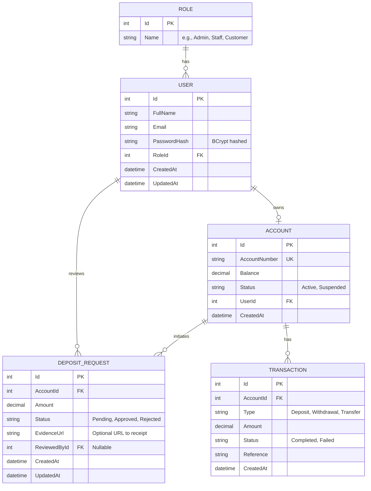

# Banking System Backend Architecture Plan

This document outlines the architecture, database schema, and project structure for the ASP.NET Core backend.

## 1. Technology Stack
- **Framework:** ASP.NET Core 8/9 Web API
- **ORM:** Entity Framework Core (EF Core)
- **Database:** MySQL
- **Authentication:** JWT (JSON Web Tokens)
- **Security:** BCrypt for password hashing

## 2. Database Schema (Entity-Relationship Design)



### Models Overview
- **Role:** Defines system access levels (Admin, Staff, Customer).
- **User:** Central identity entity. References a `Role`. Has a 1-to-1 relationship with `Account` (for customers). Staff and Admins may not need an Account.
- **Account:** Stores user balance. Linked to `User` via `UserId`.
- **DepositRequest:** Created by a Customer. Reviewed by Staff or Admin (`ReviewedById`). Modifies `Account` balance upon approval.
- **Transaction:** Standard ledger for all financial movements. Deposit approvals automatically generate a Transaction record.

## 3. Project Structure Definition

The ASP.NET Core project will use an N-Tier architecture approach focused on service boundaries.

```text
BankingAPI/
├── Controllers/            # API Endpoints (Routing & HTTP handling)
│   ├── AuthController.cs   # Login, Register, Refresh Token
│   ├── UsersController.cs  # Profile, User Management
│   ├── AccountsController.cs # Checking balance, summary
│   ├── DepositsController.cs # Creating & reviewing deposit requests
│   └── TransactionsController.cs # Fetching transaction history
├── Data/                   # EF Core DbContext & Migrations
│   └── BankingDbContext.cs
├── DTOs/                   # Data Transfer Objects (Input/Output validation)
│   ├── AuthDTOs.cs         
│   ├── DepositDTOs.cs      
│   └── UserDTOs.cs         
├── Models/                 # EF Core Domain Entities
│   ├── User.cs
│   ├── Role.cs
│   ├── Account.cs
│   ├── DepositRequest.cs
│   └── Transaction.cs
├── Services/               # Core Business Logic containing interfaces and implementations
│   ├── AuthService.cs
│   ├── AccountService.cs
│   ├── DepositService.cs
│   └── TransactionService.cs
├── Utilities/              # Shared helpers
│   ├── JwtHelper.cs        # Token generation wrapper
│   └── PasswordHelper.cs   # BCrypt hashing wrapper
├── Program.cs              # DI container, Middleware pipeline setup
└── appsettings.json        # MySQL connection strings, JWT Secrets configurations
```

## 4. API Endpoints Map

### Auth (`/api/auth`)
- `POST /register` - Register a new customer
- `POST /login` - Authenticate a user and return JWT

### Users (`/api/users`)
- `GET /me` - Get logged-in user profile (All Roles)
- `GET /` - List all users (Admin only)
- `PUT /{id}/status` - Update user status (Admin only)

### Accounts (`/api/accounts`)
- `GET /my-account` - Fetch balance and details (Customer)

### Deposits (`/api/deposits`)
- `POST /` - Submit deposit request (Customer)
- `GET /mine` - Get user's deposit requests (Customer)
- `GET /pending` - Get all pending requests (Staff)
- `PUT /{id}/review` - Approve or reject a request (Staff)

### Transactions (`/api/transactions`)
- `GET /` - Get full transaction history for the logged-in customer (Customer)
- `GET /all` - Global ledger view (Admin)

## 5. Security Details
* **JWT Authentication:** Every endpoint except `/auth/login` and `/auth/register` requires a Bearer Token. Role-based routing is achieved using ASP.NET Core's `[Authorize(Roles = "Admin, Staff")]` attribute.
* **Password Hashing:** Utilizing `BCrypt.Net-Next` to securely hash and verify passwords. Plaintext passwords never reach the database.
* **CORS:** Frontend running on Vite will need CORS enabled in `Program.cs` to accept requests from the frontend origin.
